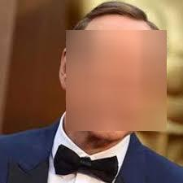
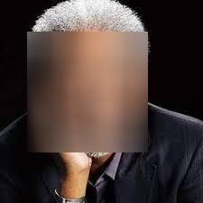

# install deps
https://www.npmjs.com/package/opencv4nodejs#how-to-install
https://www.npmjs.com/package/gm#getting-started

```
npm install --global windows-build-tools
brew install imagemagick
brew install graphicsmagick
brew install imagemagick --with-webp
npm install gm
```
# use to blur face on image via cli
node face_detection.js <path_to_image>

# result
before:


after:



before:


after:

